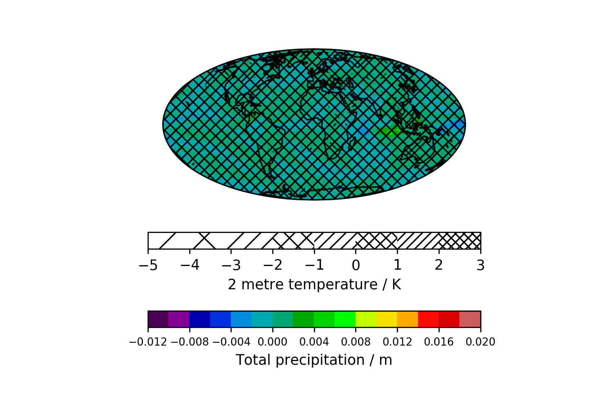

=======
results
=======

On this page the generated plots are presented:

   
   Plot of the temporally averaged 2 metre temperature and the total percipitation.
   
   

   
   Plot of the deviation of the 2019 anomaly from the temporally averaged 2 metre temperature and the total percipitation.
   
   
.. figure::  ../../fig/time_series.png
   :align:   center
   
   Plot of the globally averaged 2 metre temperature and the total percipitation as a time series.
   
   
.. figure::  ../../fig/season_winter.png
   :align:   center
   
   Plot of the seasonal mean of the 2 metre temperature and the total percipitation in winter.
   
.. figure::  ../../fig/season_spring.png
   :align:   center
   
   Plot of the seasonal mean of the 2 metre temperature and the total percipitation in spring.
   

   
   Plot of the seasonal mean of the 2 metre temperature and the total percipitation in summer.
   

   
   Plot of the seasonal mean of the 2 metre temperature and the total percipitation in autumn.
   
   

   
   Distribution of the 2 metre temperature by season.
   

   
   Distribution of the total percipitation temperature by season.
   
   
.. figure::  ../../fig/austria_2019.png
   :align:   center
   
   Plot of the annually averaged 2 metre temperature and the total percipitation of 2019 over Austria.
   
